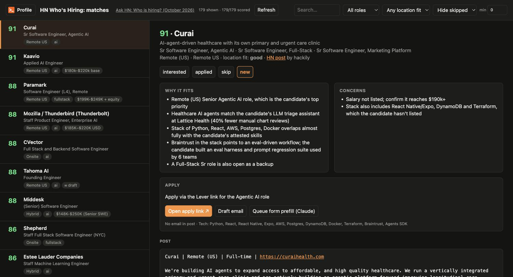
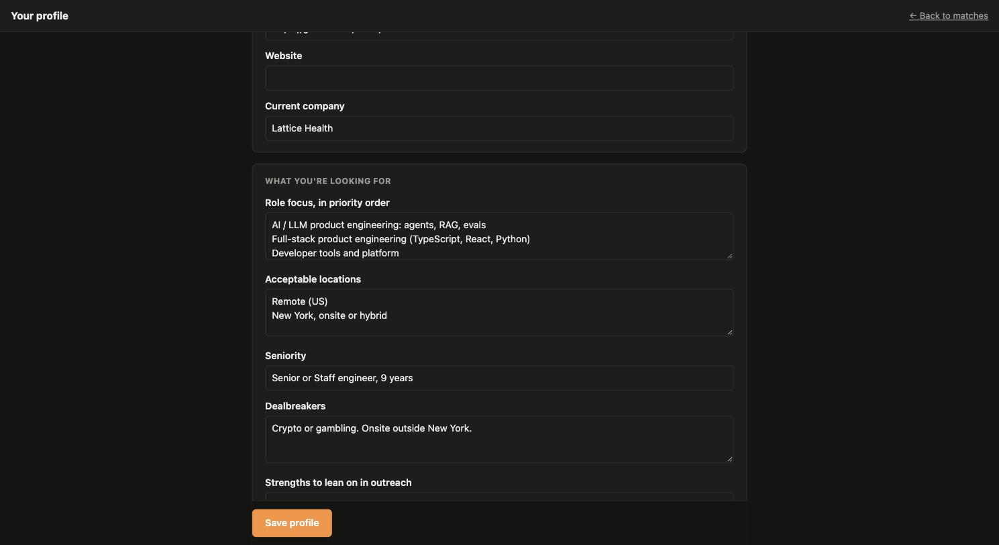
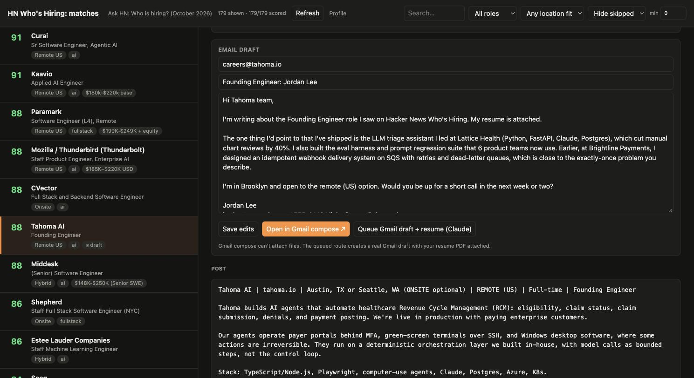

<p align="center">
  <picture>
    <source media="(prefers-color-scheme: dark)" srcset="docs/logo-dark.png">
    
  </picture>
</p>

<h3 align="center">Every post in Hacker News' monthly "Who is hiring?" thread, ranked against your resume.</h3>

<p align="center">
  
  
  
  
</p>

The thread gets hundreds of posts every month, and reading them all takes an evening. This reads every one, scores it against your resume and what you're looking for, explains each score, drafts the email, and fills in the application form. It runs on your machine, using your own Claude subscription.



## What you get

- **Every post scored 0-100 for you.** Scores weigh your role priorities, the locations you'll work from, your seniority and your dealbreakers. "Onsite in Berlin" doesn't outrank "Remote US" because the stack matched.
- **Reasons you can check.** Each match lists why it fits and what might stop it, quoting your real experience against what the post asks for.
- **Salary, stage, stack and how to apply,** pulled out of free-form posts, plus filters for role, location fit, status and score.
- **Emails in your voice.** One click writes a short, specific email that follows the post's own instructions. Open it in Gmail compose, or queue it to become a Gmail draft with your resume attached.
- **Form prefill.** Queue a job and Claude Code fills the application in Chrome from your profile, attaches your resume, and stops before submit.
- **Keyboard triage.** `j`/`k` to move, `i` interested, `a` applied, `s` skip, `d` draft, `o` open the apply link.

## Quick start

You need Python 3.10+ and [Claude Code](https://claude.com/claude-code), installed and logged in (`claude` on your PATH). Nothing to `pip install`, and no API key.

```bash
git clone https://github.com/MaxwellVolz/hn_whos_hiring
cd hn_whos_hiring
python3 server.py
```

Open **http://localhost:8787**, then:

1. **Fill in your profile.** Upload your resume PDF (its text is extracted for you), then set your role focus, locations and standard application answers.
2. **Click Refresh.** It finds this month's thread, fetches every post and scores them. About 180 posts took 2 minutes.
3. **Work the list,** top down.

Refresh again as the month goes on: only new or edited posts get scored.

<table>
  <tr>
    <td width="50%"></td>
    <td width="50%"></td>
  </tr>
  <tr>
    <td align="center"><b>Your profile</b>: the one place you describe yourself</td>
    <td align="center"><b>Drafted email</b>: specific to the post, ready for Gmail</td>
  </tr>
</table>

## It runs on your Claude subscription

All model calls go through `claude -p`, so they use whatever Claude Code is logged in with: a Pro or Max subscription, an API key, Bedrock or Vertex. Nothing else is needed.

- **On a subscription,** scoring counts against your plan's usage limits; you aren't billed per call. The dollar figures in the logs are API-rate estimates. For scale, 179 posts came to about $2 at API rates with Sonnet.
- **To spend less,** run `python3 match.py <key> --model haiku`.
- **Cached:** a post is only re-scored when it's edited or when you change your profile.

## Applying with Claude

Two buttons on each job put it in a queue: **Queue Gmail draft + resume** and **Queue form prefill**. Open Claude Code in this folder and say:

> process the outreach queue

Claude follows [`CLAUDE.md`](CLAUDE.md): it creates Gmail drafts with your resume attached, or fills application forms in Chrome from your profile. It **never sends or submits**. Every application ends with you clicking the button. It won't make accounts or type passwords. Free-text answers come from your resume, and skill checkboxes are only ticked when your profile backs them up.

The Gmail and Chrome steps need a Gmail connector (MCP) and the Claude in Chrome extension in Claude Code. Everything else works without them.

## Try it with the demo profile

```bash
HN_PROFILE_DIR=examples/demo_profile HN_DATA_DIR=/tmp/hn-demo python3 server.py
```

The screenshots above come from this fictional profile, a senior full-stack and AI engineer in Brooklyn.

## Your data stays local

Your profile, resume and every scraped post live in `profile/` and `data/`. Both are gitignored, and nothing is uploaded anywhere except the prompts Claude Code sends to Claude. Move either folder with `HN_PROFILE_DIR` / `HN_DATA_DIR`.

## How it works

| Step | File | What happens |
|---|---|---|
| Find & fetch | `scrape.py` | Finds the newest thread through HN's Algolia search, then pulls every top-level post from the official HN API. Re-runs keep first-seen times and flag edits and deletions. |
| Score | `match.py` | Sends posts in batches of 6 to `claude -p` with your profile and resume, and gets back structured JSON (score, reasons, concerns, work mode, salary, apply method). |
| Review | `server.py` | A small stdlib web server for the dashboard and Profile page. It runs Refresh in the background. |
| Write | `outreach.py` | Drafts an email from your resume, the post, and the match's reasons. |

Some useful commands:

```bash
python3 scrape.py                      # fetch this month's thread
python3 scrape.py 2026-09 <item id>    # register any thread by its HN item id
python3 match.py 2026-10 --limit 20    # score just a few posts to try it
python3 server.py 2026-09 --port 9000  # pin the dashboard to an older thread
```

Tested on macOS. Linux should work. Windows is untested.

## License

MIT
